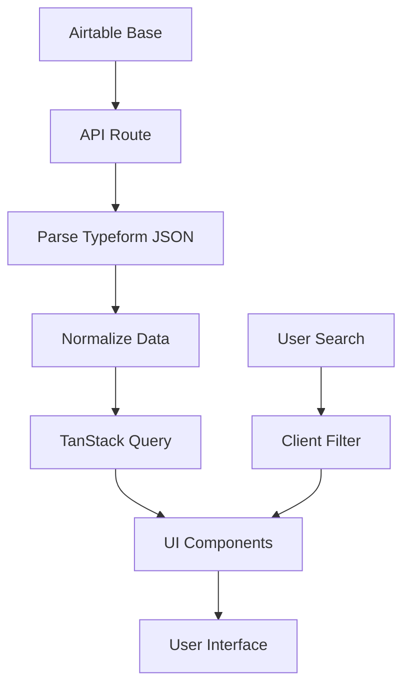

# New Hire Survey Feature Documentation

## Overview

The New Hire Survey feature is a comprehensive, mobile-first web application that displays and analyzes new hire survey responses. It fetches data from Airtable, processes Typeform JSON responses, and presents them in an organized, searchable interface grouped by organizational areas.

## Goal

Create a clean, maintainable, and user-friendly interface to:
- View new hire survey responses from Airtable
- Group responses by organizational Area in collapsible sections
- Display key highlight metrics for quick scanning
- Provide detailed Q&A views for comprehensive analysis
- Support mobile-first responsive design
- Handle data defensively with proper error states

## Architecture Overview

### Technology Stack
- **Framework**: Next.js 15 with App Router and React 19
- **UI Components**: shadcn/ui with Radix UI primitives
- **Styling**: Tailwind CSS v4
- **Data Fetching**: TanStack Query for server state management
- **Data Source**: Airtable REST API
- **TypeScript**: Strict mode for type safety

### Design Principles
- **DRY/KISS**: Simple, reusable components without over-engineering
- **Mobile-First**: Responsive design optimized for mobile devices
- **Defensive Programming**: Graceful handling of missing/malformed data
- **Feature-First Architecture**: Self-contained modules with clear boundaries

## Implementation Details

### File Structure

```
src/features/newHireSurvey/
├── api/
│   └── route.ts                    # API endpoint handler
├── hooks/
│   └── useNewHireSurvey.ts        # TanStack Query hook
├── lib/
│   ├── airtable.ts                # Airtable REST API functions
│   ├── parseTypeform.ts           # JSON parsing utilities
│   └── types.ts                   # TypeScript type definitions
├── components/
│   ├── AreaAccordion.tsx          # Area grouping with accordions
│   ├── PersonRow.tsx              # Individual person display
│   ├── PersonDetail.tsx           # Modal/sheet detail view
│   └── HighlightTable.tsx         # Summary metrics display
└── pages/
    └── NewHireSurveyPage.tsx      # Main page component

src/app/surveys/new-hire/page.tsx   # Next.js route file
src/hooks/useMediaQuery.ts          # Responsive breakpoint hook
```

### Core Components

#### 1. API Layer (`/api/airtable/new-hire`)
- **Purpose**: Server-side data fetching from Airtable
- **Security**: API keys kept server-side only
- **Data Flow**: Airtable → Parse → Normalize → Client
- **Error Handling**: Comprehensive logging and graceful degradation

```typescript
// Environment Variables Required
AIRTABLE_API_KEY=patfbYxSboedzhQTw...
AIRTABLE_BASE_ID=appNPnKFD1JPHXA89
AIRTABLE_TABLE_ID=tblAekkPI76go1vmW
AIRTABLE_VIEW_ID=viwHLY6i5peol8WaQ
```

#### 2. Data Processing (`lib/parseTypeform.ts`)
- **Input**: Raw Typeform JSON payloads stored in Airtable
- **Output**: Normalized `ParsedQA[]` arrays
- **Features**:
  - Defensive parsing handles malformed/missing data
  - Smart highlight selection using heuristic keyword matching
  - Support for multiple answer types (text, number, boolean, choice)
  - Future-proof against schema changes

```typescript
// Example processed data structure
type ParsedQA = {
  key: string;                    // Question title
  value: string | number | boolean | null;  // Normalized answer
  raw?: unknown;                  // Original data for debugging
}

type Person = {
  id: string;
  name: string;
  area: string;
  qa: ParsedQA[];                 // All questions/answers
  highlights: ParsedQA[];         // 6 key metrics for summary
}
```

#### 3. Client-Side State (`hooks/useNewHireSurvey.ts`)
- **TanStack Query**: Caching, background updates, error handling
- **Search Filtering**: Client-side name/area filtering
- **Performance**: 5-minute stale time, 2 retry attempts
- **Return Values**: `{ data, isLoading, error, filteredData, searchQuery, setSearchQuery }`

#### 4. UI Components

**AreaAccordion.tsx**
- Groups people by organizational area
- Uses shadcn Accordion for collapsible sections
- Shows person count badges
- Handles empty states gracefully

**PersonRow.tsx**
- Displays individual person with highlight summary
- Clickable cards with hover effects
- "View Details" button for accessibility
- Mobile-optimized tap targets (≥44px)

**PersonDetail.tsx**
- Responsive modal: Sheet (mobile) / Dialog (desktop)
- Complete Q&A list with proper formatting
- Color-coded responses (red/yellow/green for scales)
- Scrollable content with proper spacing

**HighlightTable.tsx**
- Compact 2-6 line summary of key metrics
- Tooltip support for long content
- Smart value formatting and color coding
- Handles missing data gracefully

### Data Flow



1. **Server-Side**: Airtable → API Route → JSON Processing → Normalized Response
2. **Client-Side**: TanStack Query → Search Filter → UI Rendering
3. **User Interaction**: Search → Detail View → Close Modal

### Key Features

#### Responsive Design
- **Mobile**: Bottom sheet modals, optimized spacing, touch-friendly
- **Desktop**: Center dialogs, hover states, keyboard navigation
- **Breakpoint**: 768px using custom `useMediaQuery` hook

#### Search Functionality
- **Scope**: Person names and organizational areas
- **Implementation**: Client-side filtering for instant results
- **UI**: Real-time result counts and feedback

#### Error Handling
- **API Errors**: User-friendly error messages with retry options
- **JSON Parsing**: Graceful fallbacks for malformed data
- **Loading States**: Skeleton components during data fetching
- **Empty States**: Helpful messaging for no results

#### Accessibility
- **ARIA Labels**: Proper labeling for screen readers
- **Keyboard Navigation**: Full keyboard support
- **Semantic HTML**: Proper heading hierarchy and landmarks
- **Focus Management**: Modal focus trapping

### Environment Configuration

Required environment variables in `.env.local`:

```bash
# Airtable Configuration
AIRTABLE_API_KEY=your_api_key_here
AIRTABLE_BASE_ID=appNPnKFD1JPHXA89
AIRTABLE_TABLE_ID=tblAekkPI76go1vmW
AIRTABLE_VIEW_ID=viwHLY6i5peol8WaQ
```

## Testing the Feature

### Manual Testing
1. Navigate to `http://localhost:3000/surveys/new-hire`
2. Verify data loads from Airtable
3. Test accordion expand/collapse functionality
4. Click person cards to open detail views
5. Test search functionality with names and areas
6. Verify responsive behavior on mobile/desktop
7. Test error states by temporarily breaking API connection

### Test Data Structure
The feature expects Airtable records with these fields:
- `Full Name` or `Name`: Person's display name
- `Area`: Organizational area for grouping
- `New Hire Survey Answers`: JSON string containing Typeform response

Sample Typeform JSON structure:
```json
{
  "form_response": {
    "definition": {
      "fields": [
        {
          "id": "field_id",
          "ref": "field_ref", 
          "title": "Question text",
          "type": "opinion_scale"
        }
      ]
    },
    "answers": [
      {
        "type": "number",
        "number": 8,
        "field": {
          "id": "field_id",
          "ref": "field_ref"
        }
      }
    ]
  }
}
```

## Current Status & Outcomes

### ✅ Completed Features
- [x] Mobile-first responsive design
- [x] Airtable integration with environment configuration
- [x] Defensive Typeform JSON parsing
- [x] Area-based accordion grouping
- [x] Highlight summary extraction (6 key metrics)
- [x] Full Q&A detail views with responsive modals
- [x] Real-time search functionality
- [x] Loading states and error handling
- [x] TypeScript strict mode compliance
- [x] ESLint error resolution
- [x] Accessibility features (ARIA, keyboard navigation)
- [x] Performance optimization (caching, minimal re-renders)

### 🎯 Success Metrics
- **Code Quality**: 0 TypeScript errors, 0 ESLint errors
- **Performance**: 5-minute cache, optimistic loading states  
- **User Experience**: <44px tap targets, smooth animations
- **Maintainability**: Feature-first architecture, comprehensive types
- **Accessibility**: WCAG compliant interactive elements

### 🚀 Future Enhancements

#### Short-term (Next Sprint)
- [ ] **Export Functionality**: CSV/PDF export of filtered results
- [ ] **Bulk Actions**: Select multiple people for batch operations
- [ ] **Advanced Filtering**: Filter by response values, date ranges
- [ ] **Sorting Options**: Sort by completion date, response scores
- [ ] **Print Styles**: Optimized printing for reports

#### Medium-term (Next Quarter)
- [ ] **Analytics Dashboard**: Response trends, completion rates
- [ ] **Email Integration**: Send follow-up emails to incomplete surveys
- [ ] **Manager Views**: Area-specific dashboards for managers
- [ ] **Integration Testing**: Automated E2E tests with Playwright
- [ ] **Performance Monitoring**: Add analytics for load times

#### Long-term (Future Releases)
- [ ] **Real-time Updates**: WebSocket integration for live data
- [ ] **Advanced Analytics**: ML-powered sentiment analysis
- [ ] **Multi-tenant Support**: Organization-based data segregation
- [ ] **API Documentation**: OpenAPI specs for external integrations
- [ ] **Mobile App**: Native iOS/Android applications

## Development Guidelines

### Adding New Features
1. Follow the existing feature-first architecture
2. Add new components to `src/features/newHireSurvey/components/`
3. Update types in `lib/types.ts` for new data structures
4. Add proper TypeScript types and error handling
5. Include loading states and empty states
6. Test responsiveness on mobile and desktop
7. Add accessibility features (ARIA labels, keyboard support)

### Code Style
- Use TypeScript strict mode (no `any` types)
- Follow existing component patterns (small, focused components)
- Implement proper error boundaries
- Add JSDoc comments for complex functions
- Use shadcn/ui components consistently
- Follow Tailwind CSS utility-first approach

### Performance Considerations
- Use TanStack Query for all server state
- Implement proper memoization for expensive calculations  
- Lazy load heavy components when possible
- Optimize images and assets
- Monitor bundle size impact

### Debugging
- API responses logged to console in development
- Use React Query DevTools for cache inspection
- Network tab for Airtable API debugging
- Browser DevTools for responsive testing

## Troubleshooting

### Common Issues

**"Missing Airtable environment variables" error**
- Verify `.env.local` contains all required variables
- Restart development server after adding variables
- Check variable names match exactly

**"No survey responses available" for existing data**
- Verify JSON format in Airtable matches expected Typeform structure
- Check console logs for parsing errors
- Use test fixture in `parseTypeform.ts` for debugging

**Mobile modal not showing properly**
- Verify `useMediaQuery` hook is working correctly
- Check z-index conflicts with other UI elements
- Test on actual mobile devices, not just browser DevTools

**Search not working**
- Ensure search is case-insensitive
- Check if data is properly loaded before filtering
- Verify search covers both name and area fields

### Performance Issues
- Check TanStack Query cache in DevTools
- Monitor network requests for unnecessary calls
- Use React Profiler for component re-render analysis
- Consider pagination for large datasets (>100 people)

## Contributing

### Getting Started
1. Clone repository and install dependencies
2. Copy `.env.example` to `.env.local` and add Airtable credentials
3. Run `npm run dev` to start development server
4. Navigate to `/surveys/new-hire` to test the feature
5. Make changes and test thoroughly before committing

### Pull Request Checklist
- [ ] TypeScript compilation passes (`npx tsc --noEmit`)
- [ ] ESLint passes (`npm run lint`)
- [ ] All tests pass (`npm test`)
- [ ] Responsive design tested on mobile and desktop
- [ ] Accessibility tested with screen reader
- [ ] Error handling tested (network errors, malformed data)
- [ ] Documentation updated for new features

## Contact

For questions about this feature or to contribute improvements:
- Review the implementation in `src/features/newHireSurvey/`
- Check existing GitHub issues for known problems
- Create new issues for bugs or feature requests
- Follow the established code patterns and architecture

---

*This feature was implemented using Claude Code with a focus on maintainability, accessibility, and user experience. The architecture supports future enhancements while maintaining clean, testable code.*